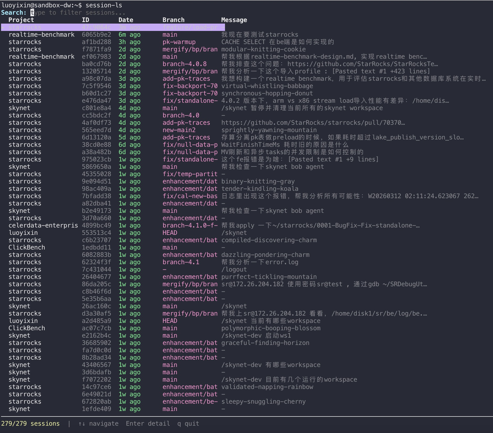
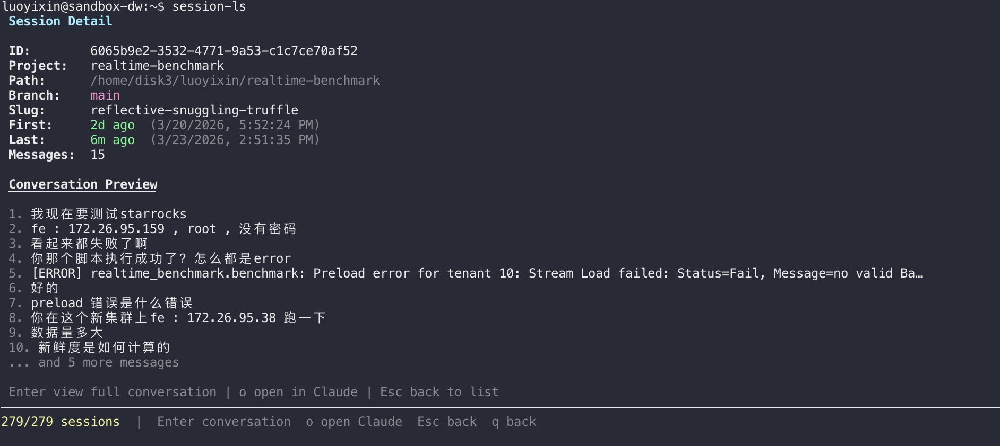

# session-ls

A TUI for browsing and searching Claude Code sessions.

Discovers sessions from `~/.claude/history.jsonl` and project directories, lets you fuzzy search and preview conversations.

## Screenshots

**Session List** — browse all sessions with fuzzy search:



**Session Detail** — preview conversation messages:



## Install

```bash
npm install -g session-ls@latest
```

### From Source

```bash
npm install
npm run build
npm link
```

## Usage

```bash
# Development
npm run dev

# After build
session-ls
```

## Keybindings

| Key | Action |
|---|---|
| `↑` / `↓` | Navigate sessions |
| `Enter` | View session detail |
| `o` | Open session in Claude Code (detail view) |
| `Esc` | Back to list / clear search |
| `q` | Quit (when search is empty) |

Type anything to fuzzy search across project names, slugs, branches, and messages.

## Tech Stack

- TypeScript + ESM
- [ink](https://github.com/vadimdemedes/ink) (React for CLI)
- [fuse.js](https://www.fusejs.io/) for fuzzy search
